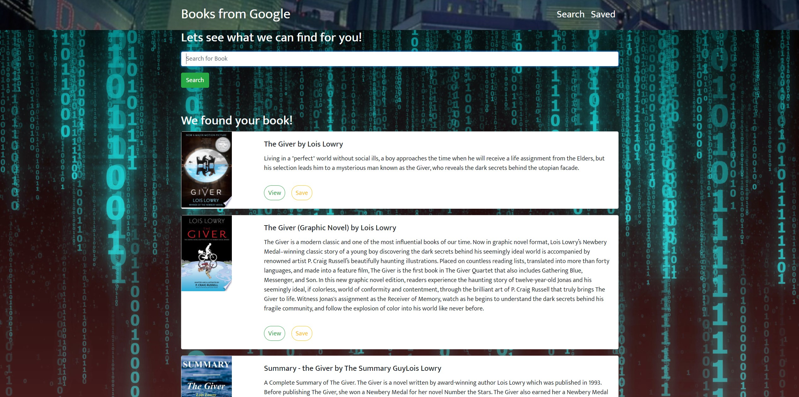

### Google Books

# Description

In this activity, you'll create a new React-based Google Books Search app. This assignment requires you to create React components, work with helper/util functions, and utilize React lifecycle methods to query and display books based on user searches. You'll also use Node, Express and MongoDB so that users can save books to review or purchase later.

## Heroku Link

## screenshot

## Available Scripts

In the project directory, you can run:

### `npm start`

Runs the app in the development mode.\
Open [http://localhost:3000](http://localhost:3000) to view it in the browser.

The page will reload if you make edits.\
You will also see any lint errors in the console.

### `npm test`

Launches the test runner in the interactive watch mode.\
See the section about [running tests](https://facebook.github.io/create-react-app/docs/running-tests) for more information.

### Author

Steve E Hernandez